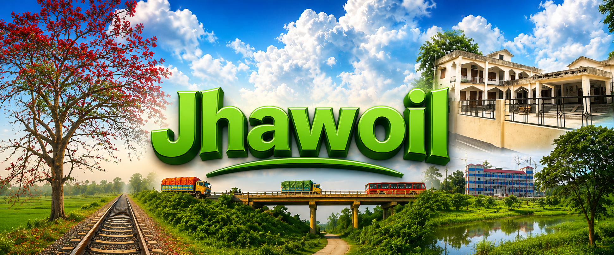
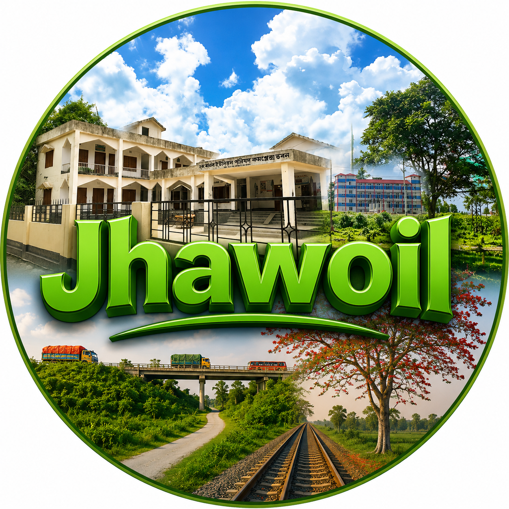

# 🌿 ঝাঐল গ্রাম | Jhawoil Village

  

  

  <strong>সিরাজগঞ্জের কামারখন্দ উপজেলার ঐতিহ্যবাহী, সবুজ শ্যামল ও সমৃদ্ধ জনপদ</strong> 
  <em>The Illustrious & Historic Village of Kamarkhanda, Sirajganj, Bangladesh</em>

  
  
  
  

  <!-- Visitors Counter Badge -->
  

---

## 📌 সূচিপত্র (Table of Contents)

- [📖 পরিচিতি ও ভূ-প্রকৃতি](#-পরিচিতি-ও-ভূ-প্রকৃতি)
- [🌱 নামকরণের ইতিহাস](#-নামকরণের-ইতিহাস)
- [🏛️ প্রাচীন ইতিহাস ও যুগপরিক্রমা](#️-প্রাচীন-ইতিহাস-ও-যুগপরিক্রমা)
- [🎓 পাটিগণিত সম্রাট যাদব চন্দ্র চক্রবর্তী](#-পাটিগণিত-সম্রাট-যাদব-চন্দ্র-চক্রবর্তী)
- [🎖️ মুক্তিযুদ্ধ ও জাতীয় বীরত্ব](#️-মুক্তিযুদ্ধ-ও-জাতীয়-বীরত্ব)
- [🌾 হস্তশিল্প: ঐতিহ্যবাহী শীতল পাটি](#-হস্তশিল্প-ঐতিহ্যবাহী-শীতল-পাটি)
- [🎪 ৩৭৫ বছরের ঐতিহ্যবাহী গোষ্ঠের মেলা](#-৩৭৫-বছরের-ঐতিহ্যবাহী-গোষ্ঠের-মেলা)
- [📸 নয়নাভিরাম চিত্রশালা (১০টি আলোকচিত্র)](#-নয়নাভিরাম-চিত্রশালা-১০টি-আলোকচিত্র)
- [🎥 অফিসিয়াল ভিডিও ও ইউটিউব মিডিয়া হাব](#-অফিসিয়াল-ভিডিও-ও-ইউটিউব-মিডিয়া-হাব)
- [🌦️ ষড়ঋতুর প্রাকৃতিক রূপ](#️-ষড়ঋতুর-প্রাকৃতিক-রূপ)
- [🤝 সমাজ, অর্থনীতি ও সম্প্রীতির স্তম্ভ](#-সমাজ-অর্থনীতি-ও-সম্প্রীতির-স্তম্ভ)
- [🗺️ মানচিত্র ও যাতায়াত নির্দেশিকা](#️-মানচিত্র-ও-যাতায়াত-নির্দেশিকা)
- [🌐 অফিসিয়াল সোশ্যাল ও ওয়েব লিংক](#-অফিসিয়াল-সোশ্যাল-ও-ওয়েব-লিংক)

---

## 📖 পরিচিতি ও ভূ-প্রকৃতি

**ঝাঐল গ্রাম** বাংলাদেশের উত্তরাঞ্চলের ঐতিহ্যবাহী ও প্রাণবন্ত জেলা সিরাজগঞ্জের কামারখন্দ উপজেলার অন্তর্গত একটি প্রাচীন, স্বনামধন্য ও ইতিহাসবাহী জনপদ। প্রমত্তা যমুনা নদীর উর্বর পলিমাটি বিধৌত এই সমভূমি শতাব্দী ধরে কৃষি, শিক্ষা, সংস্কৃতি, লোকজ কুটির শিল্প এবং অটুট সামাজিক সম্প্রীতির এক অনন্য মিলনস্থল হিসেবে সমাদৃত।

ঢাকা-রাজশাহী মহাসড়কের সন্নিকটে অবস্থানের কারণে ভৌগোলিক ও কৌশলগত দিক থেকেও ঝাঐল অত্যন্ত গুরুত্বপূর্ণ। বিখ্যাত **ঝাঐল ওভারব্রিজ** ও সংলগ্ন মহাসড়ক প্রতিদিন দেশের হাজার হাজার মানুষের যাতায়াত সহজ করে তুলেছে। চারপাশে চিরসবুজ শস্যক্ষেত, শান্ত মেঠোপথ, পাখির কলকাকলি এবং স্নিগ্ধ গ্রামীণ পরিবেশ মিলেমিশে এক অপরূপ প্রশান্তির আবহ সৃষ্টি করেছে।

---

## 🌱 নামকরণের ইতিহাস

“ঝাঐল” নামের উৎপত্তি নিয়ে স্থানীয়ভাবে বেশ কয়েকটি চমকপ্রদ জনশ্রুতি প্রচলিত রয়েছে:
1. **ঝাউ বনের প্রাচুর্য**: প্রবীণদের বয়ান ও প্রাচীন বর্ণনামতে, শত শত বছর পূর্বে এই অঞ্চলটি ঘন ঝাউ বন, গভীর খাল-বিল এবং জলজ উদ্ভিদে পরিপূর্ণ ছিল। সেই প্রাচুর্যপূর্ণ **“ঝাউ”** গাছের অস্তিত্ব ও লোকমুখের ধ্বনি পরিবর্তনের মধ্য দিয়ে ধীরে ধীরে **“ঝাঐল”** নামের রূপলাভ ঘটে।
2. **নৌকা ও দিক নির্ণয়**: প্রাচীনকালে নদীপথে যাতায়াতকারী বণিক ও মাঝিরা দূর থেকে এই বনরাজিকে দেখে দিক নির্ণয় করত। কালের বিবর্তনে আঞ্চলিক ভাষার টানে এই নামটি বর্তমান স্থায়ী রূপ লাভ করে।

---

## 🏛️ প্রাচীন ইতিহাস ও যুগপরিক্রমা

- **প্রাচীন ও মধ্যযুগ**: যমুনার পলিবিধৌত মাটিতে কৃষিকেন্দ্রিক সমৃদ্ধ জনবসতি। নদীপথ ছিল ধান, পাট ও কৃষি পণ্যের প্রধান বাণিজ্য ধমনী।
- **ব্রিটিশ আমল (১৮৫৫ - ১৯৪৭)**: শিক্ষা ও জ্ঞানচর্চার নবজাগরণ। বিদ্যালয় ও পাঠশালা প্রতিষ্ঠা এবং গণিত সম্রাট যাদব চন্দ্র চক্রবর্তীর জন্ম।
- **১৯৭১ মুক্তিযুদ্ধ**: মাতৃভূমির স্বাধীনতা সংগ্রামে অবিস্মরণীয় অবদান। মুক্তিযোদ্ধাদের আশ্রয়, খাদ্য ও রণক্ষেত্রের বীরত্বপূর্ণ ভূমিকা।
- **আধুনিক যুগ**: ঝাঐল ওভারব্রিজ নির্মাণ, আন্তর্জাতিক প্রবাসী রেমিট্যান্স যোদ্ধা, আধুনিক শিক্ষা এবং ডিজিটাল গ্রামের পথে অগ্রযাত্রা।

---

## 🎓 পাটিগণিত সম্রাট যাদব চন্দ্র চক্রবর্তী

ঝাঐল গ্রামের সর্বশ্রেষ্ঠ ঐতিহাসিক গর্ব হলেন অবিভক্ত ভারতবর্ষের কিংবদন্তিতুল্য গণিতবিদ ও শিক্ষাবিদ **পণ্ডিত যাদব চন্দ্র চক্রবর্তী (১৮৫৫ – ১৯২০)**। 

> *"সহজ, প্রাঞ্জল ও বাস্তবমুখী উদাহরণের সাহায্যে জটিল পাটিগণিতকে তিনি শিক্ষার্থীদের আনন্দময় করে তুলেছিলেন—যাঁর গ্রন্থাবলী সমগ্র ভারতবর্ষের পাঠ্যবই হিসেবে শতাব্দী পার করেছে।"*

* **রচিত গ্রন্থাবলী**: তাঁর রচিত গণিত ও বীজগণিতের বইগুলো বাংলা, ইংরেজি, হিন্দি, মারাঠি, উর্দু এবং বার্মিজ ভাষায় অনূদিত হয়ে ভারত, পাকিস্তান, বার্মা ও বাংলাদেশের স্কুল-কলেজে পাঠ্যপুস্তক হিসেবে পঠিত হয়েছে।
* গণিত শিক্ষাকে সর্বজনীন করার জন্য তিনি ইতিহাসে **“পাটিগণিতের সম্রাট” (Emperor of Arithmetic)** হিসেবে অমর হয়ে আছেন।

---

## 🎖️ মুক্তিযুদ্ধ ও জাতীয় বীরত্ব

১৯৭১ সালের মহান মুক্তিযুদ্ধে ঝাঐল গ্রামের বীর সন্তানেরা দেশমাতৃকার ডাকে জীবন বাজি রেখে সম্মুখ সমরে অংশগ্রহণ করেন। এলাকার মুক্তিকামী জনতা মুক্তিযোদ্ধাদের নিরাপদ আশ্রয়, খাদ্য ও রসদ সরবরাহ করে স্বাধীনতার সূর্য ছিনিয়ে আনতে বীরত্বপূর্ণ ভূমিকা পালন করেন।

---

## 🌾 হস্তশিল্প: ঐতিহ্যবাহী শীতল পাটি

ঝাঐল গ্রামের অন্যতম সুপ্রাচীন গৌরব হলো এখানকার ঐতিহ্যবাহী **শীতল পাটি শিল্প**। 
- মুর্তা বা পাতি বেতের কাণ্ড থেকে নিপুণ দক্ষতায় সূক্ষ্ম আঁশ ছাড়িয়ে পরম যত্নে এই পাটি বোনা হয়।
- গ্রীষ্মের তীব্র গরমে এই শীতল পাটির প্রাকৃতিক স্নিগ্ধতা শরীর ও মনে শীতল পরশ এনে দেয়।
- এই লোকজ কুটির শিল্প বহু গ্রামীণ নারীকে অর্থনৈতিকভাবে স্বাবলম্বী ও ক্ষমতায়িত করেছে।

---

## 🎪 ৩৭৫ বছরের ঐতিহ্যবাহী গোষ্ঠের মেলা

প্রতি বছর বৈশাখ মাসের শুভ পূর্ণিমা তিথিতে ঝাঐল গ্রামে অনুষ্ঠিত হয় প্রায় **৩৭৫ বছরের প্রাচীন ঐতিহাসিক “গোষ্ঠের মেলা”**।
- এটি সকল ধর্ম, বর্ণ ও শ্রেণি-পেশার মানুষের এক মহামিলনমেলা।
- ঐতিহ্যবাহী কাঠের নাগরদোলা, গরম জিলাপি, বাতাসা, কদমা, মৃৎশিল্পের পুতুল, মাটির হাঁড়ি-পাতিল, বাঁশের তৈজসপত্র এবং গ্রামীণ লোকসঙ্গীতের মধুর মূর্ছনায় মুখরিত হয় মেলা প্রাঙ্গণ।

---

## 📸 নয়নাভিরাম চিত্রশালা (১০টি আলোকচিত্র)

ওয়েবসাইটে সংরক্ষিত ঝাঐল গ্রামের ১০টি বাছাইকৃত আলোকচিত্রের তালিকা:

| ক্রমি নং | ছবির ফাইল | বিষয়বস্তু / ক্যাপশন | বিভাগ / ট্যাগ |
| :---: | :--- | :--- | :--- |
| **১** | `img/0.jpg` | **ঝাঐল রেল ক্রসিং ও মেঠোপথ** | `রেল ক্রসিং` |
| **২** | `img/1.jpg` | **গোধূলির আলোয় ঝাঐল প্রান্তর (Sunset Horizon)** | `প্রাকৃতিক রূপ` |
| **৩** | `img/6.png` | **নীল আকাশের নিচে ঝাঐল ওভারব্রিজ ও রেলপথ** | `অবকাঠামো` |
| **৪** | `img/4.png` | **প্রকৃতির রূপ — শাপলা ও শ্যামল ভূমি** | `ঋতু ও প্রকৃতি` |
| **৫** | `img/5.png` | **সবুজের বুক চিরে ট্রেনের যাত্রা ও নদীপথ (Peaceful Village)** | `শান্ত জনপদ` |
| **৬** | `img/9.jpg` | **মহাসড়ক ও ঝাঐল ফ্লাইওভার সংযোগ সড়ক** | `মহাসড়ক সংযোগ` |
| **৭** | `img/7.jpg` | **মেঠোপথ ও ওভারব্রিজের দীর্ঘ স্প্যান** | `গ্রামীণ পথ` |
| **৮** | `img/8.jpg` | **রেলগেট ও ওভারব্রিজের দৃষ্টিনন্দন ফ্রেম** | `রেলপথ` |
| **৯** | `img/2.jpg` | **গাছপালার সান্নিধ্যে ঝাঐল ওভারব্রিজ** | `ঐতিহ্যবাহী সেতু` |
| **১০** | `img/3.jpg` | **রেলপথের নয়নাভিরাম ল্যান্ডস্কেপ** | `প্রাকৃতিক দৃষ্টিকোণ` |

---

## 🎥 অফিসিয়াল ভিডিও ও ইউটিউব মিডিয়া হাব

অফিসিয়াল ইউটিউব চ্যানেল: **[@Jhawoil](https://www.youtube.com/@Jhawoil)**

| নং | ভিডিও লিংক | বিবরণ |
| :---: | :--- | :--- |
| **১** | [YouTube Video 1 (Featured)](https://youtu.be/ellXfYjcmY8) | **প্রধান প্রামাণ্যচিত্র** — ঝাঐল গ্রামের নান্দনিক রূপ |
| **২** | [YouTube Video 2](https://youtu.be/h6jz9u1sBrg) | ঝাঐল প্রাকৃতিক দৃশ্য ও ল্যান্ডস্কেপ |
| **৩** | [YouTube Video 3](https://youtu.be/hv06km8AS7U) | ওভারব্রিজ ও গ্রামীণ জীবনধারা |
| **৪** | [YouTube Video 4](https://youtu.be/07Z_o3RbUTs) | ঐতিহ্য ও গ্রামীণ উৎসব |
| **৫** | [YouTube Video 5](https://youtu.be/BRhAIvbpnKg) | নদীপথ ও শ্যামলিমার সৌন্দর্য |
| **৬** | [YouTube Video 6](https://youtu.be/PI0zR52ash0) | শান্ত জনপদের স্নিগ্ধ চিত্র |

---

## 🌦️ ষড়ঋতুর প্রাকৃতিক রূপ

- **গ্রীষ্মকাল**: আম-কাঁঠালের মিষ্টি সুবাস ও বটবৃক্ষের সুশীতল ছায়া।
- **বর্ষাকাল**: পানিতে টইটুম্বর খাল-বিল ও ডিঙি নৌকায় গ্রামীণ জীবন।
- **শরৎকাল**: শুভ্র কাশফুলের মেলা ও নীল আকাশে পেঁজা তুলোর মেঘ।
- **হেমন্তকাল**: সোনালি ধানের সমাহার ও নবান্ন উৎসবের পিঠা-পায়েস।
- **শীতকাল**: ভোরের কুয়াশার চাদর, খেজুরের রস ও হলুদ সরিষা ফুলের প্রান্তর।
- **বসন্তকাল**: গাছে গাছে কচি পাতা, পলাশ-শিমুল ও কোকিলের মিষ্টি কুহুতান।

---

## 🤝 সমাজ, অর্থনীতি ও সম্প্রীতির স্তম্ভ

1. **উর্বর কৃষি ও মৎস্য**: ধান, গম, সরিষা, পাট, ভুট্টা এবং আধুনিক ডেইরি ও মৎস্য খামার।
2. **ধর্মীয় সম্প্রীতি**: মুসলিম ও হিন্দু সম্প্রদায়ের শতবর্ষের ভ্রাতৃত্ব ও সৌহার্দ্যপূর্ণ বসবাস।
3. **শিক্ষা ও মেধা**: বিশ্ববিদ্যালয়, মেডিকেল ও ইঞ্জিনিয়ারিং অঙ্গনে ঝাঐলের শিক্ষার্থীদের সাফল্য।
4. **ক্রীড়া ও সংস্কৃতি**: ফুটবল, ক্রিকেট ও গ্রামীণ ক্রীড়া উৎসব।
5. **প্রবাসী সমাজের অবদান**: রেমিট্যান্স ও সমাজকল্যাণমূলক কাজে প্রবাসীদের অসামান্য অনুদান।
6. **আতিথেয়তা**: পারিবারিক ঐক্য ও হৃদয়স্পর্শী গ্রামীণ আতিথেয়তা।

---

## 🗺️ মানচিত্র ও যাতায়াত নির্দেশিকা

* **ঢাকা থেকে**: গাবতলী বা মহাখালী থেকে উত্তরবঙ্গগামী যে কোনো বাসে যমুনা সেতু পার হয়ে **ঝাঐল ওভারব্রিজ** পয়েন্টে নামলেই সরাসরি গ্রামে প্রবেশ করা যায়।
* **সিরাজগঞ্জ শহর থেকে**: সিরাজগঞ্জ বাজার স্টেশন বা শহর থেকে সিএনজি/অটোরিকশায় কামারখন্দ হয়ে মাত্র ১৫-২০ মিনিট।
* **বগুড়া / রাজশাহী থেকে**: হাটিকুমরুল গোলচত্বর পার হয়ে ঢাকা অভিমুখে কয়েক কিলোমিটার দূরেই ঝাঐল ওভারব্রিজ।

---

## 🌐 অফিসিয়াল সোশ্যাল ও ওয়েব লিংক

* 🌍 **অফিসিয়াল ওয়েবসাইট**: [website.jhawoilgram.workers.dev](https://website.jhawoilgram.workers.dev)
* 📺 **ইউটিউব চ্যানেল**: [@Jhawoil (YouTube)](https://www.youtube.com/@Jhawoil)
* 👥 **ফেসবুক পেজ**: [Jhawoil Gram Official Page](https://www.facebook.com/JhawoilGram/)
* 🤝 **কমিউনিটি গ্রুপ**: [আমাদের ঝাঐল গ্রুপ](https://www.facebook.com/groups/Amader.Jhawoil)

---

  <strong>&copy; ২০২৬ ঝাঐল গ্রাম কমিউনিটি। কামারখন্দ, সিরাজগঞ্জ, বাংলাদেশ। সর্বস্বত্ব সংরক্ষিত।</strong> 
  <em>Preserving Heritage, Inspiring Tomorrow.</em>

